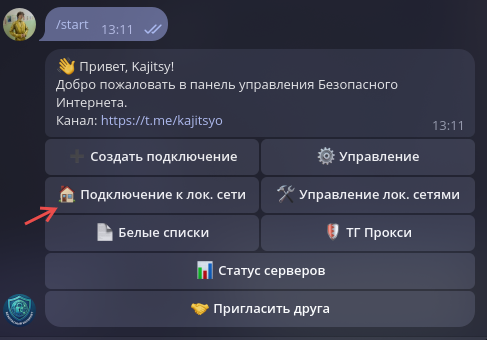
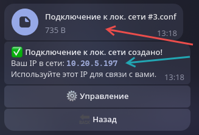
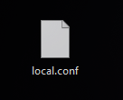
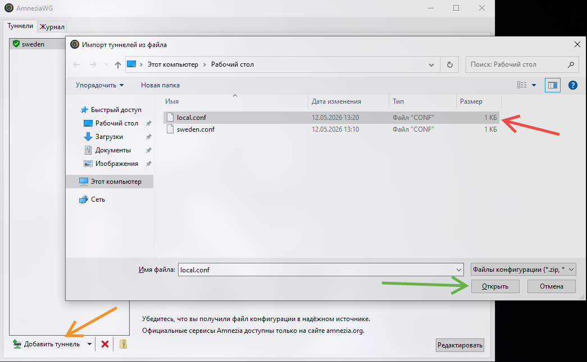
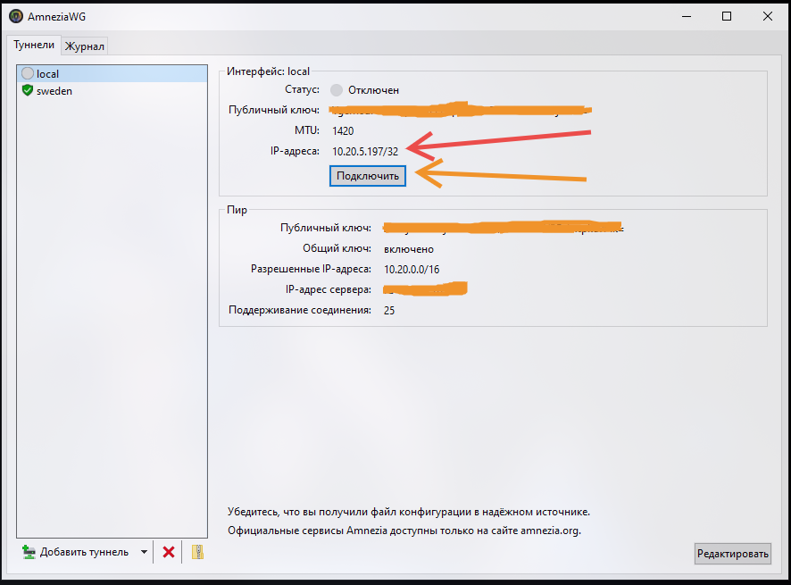
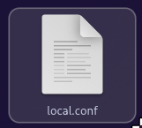
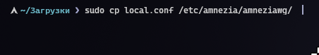
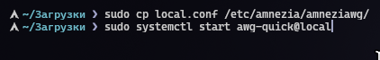

# Инструкция по подключению к локальной сети [@Net_Secure_Bot](https://t.me/net_secure_bot)
Лучший VPN: [@Net_Secure_Bot](https://t.me/net_secure_bot)

Для подключения к локальной сети используется протокол AmneziaWG 2.0 и программа AmneziaWG:

Windows: https://github.com/amnezia-vpn/amneziawg-windows-client

Linux: https://github.com/amnezia-vpn/amneziawg-linux-kernel-module

Android: [Google Play Market](https://play.google.com/store/apps/details?id=org.amnezia.awg&hl=ru), [GitHub](https://github.com/amnezia-vpn/amneziawg-android)

iOS, iPadOS, MacOS: [App Store](https://github.com/amnezia-vpn/amneziawg-android)

Данные подключения не являются способом обхода блокировок и не должны конфликтовать с основным VPN-ом. В случае возникновения проблем пишите [@ystijak](https://github.com/amnezia-vpn/amneziawg-windows-client)

## Как подключиться:
### Windows:
0. Установите [AmneziaWG с GitHub](https://github.com/amnezia-vpn/amneziawg-windows-client)

1. Создаёте подключение к локальной сети в боте [@Net_Secure_Bot](https://t.me/net_secure_bot)

2. Получите Ваш файл и Ваш IP в локальной сети

#Красная стрелка - файл; Синяя стрелка - IP

3. Для удобства переименуйте файл в local.conf

4. Добавьте local.conf в AmneziaWG

#1. Добавьте туннель; 2. Выберите local.conf; 3. Нажмите Открыть

5. Подключитесь к туннелю local

#Красная стрелка - Ваш IP внутри локальной сети

### Linux (на примере CachyOS):

0. Установите [amneziawg-linux-kernel-module](https://github.com/amnezia-vpn/amneziawg-linux-kernel-module) по [инструкции с GitHub](https://github.com/amnezia-vpn/amneziawg-linux-kernel-module)

1. Создаёте подключение к локальной сети в боте [@Net_Secure_Bot](https://t.me/net_secure_bot)

2. Получите Ваш файл и Ваш IP в локальной сети

#Красная стрелка - файл; Синяя стрелка - IP

3. Для удобства переименуйте файл в local.conf

4. Переходите в каталог с файлом и копируйте его в /etc/amnezia/amneziawg (необходим доступ к sudo)

5. Запустите службу awg-quick с local.conf

